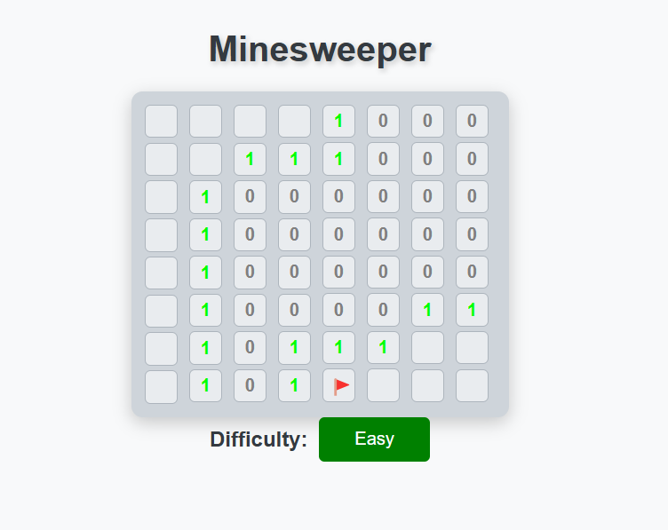
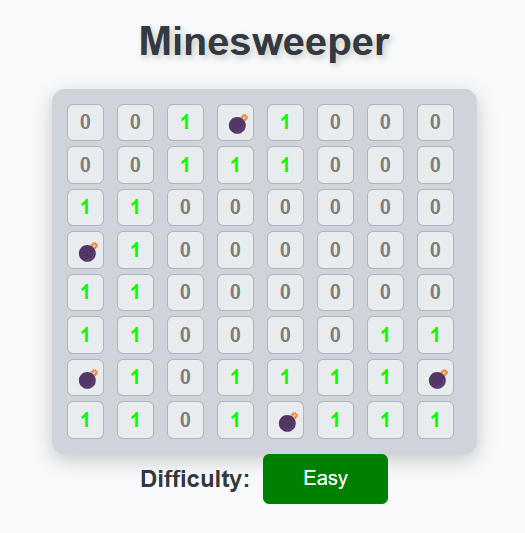
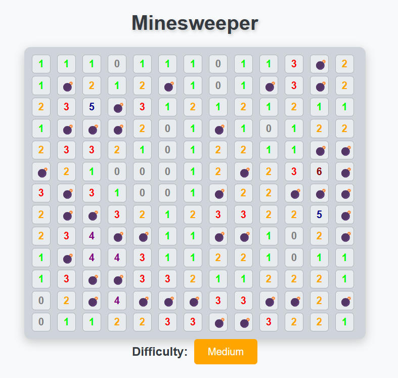
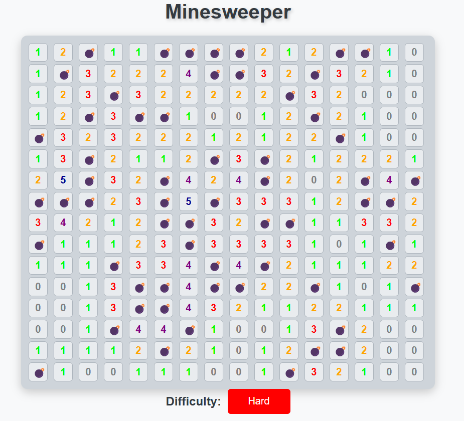

# Minesweeper

### A web for playing minesweeper
[WEB](https://blameazu.github.io/minesweeper/main.html)

# Functions

* Basic Minesweeper functions

* Difficulty selection system
    * Easy $8 \times 8$ grids and $5$ bombs
    * Medium $13 \times 13$ grids and $40$ bombs
    * Hard $16 \times 16$ grids and $60$ bombs

* Automatically expandsion

* Flag toggle

# How it works?

* Using **html** to generate the construction of web

* Using **css** to make my web prettier!

* Using **javascript** to dispose the operations of user input

* Also add some algorithms to operate more efficiently and clearly

# Screenshot

