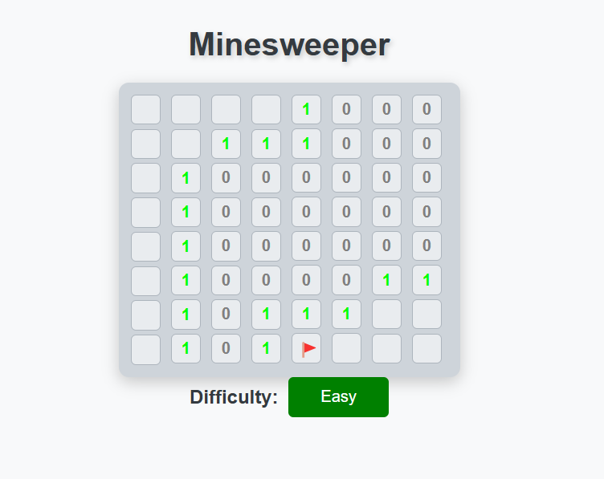
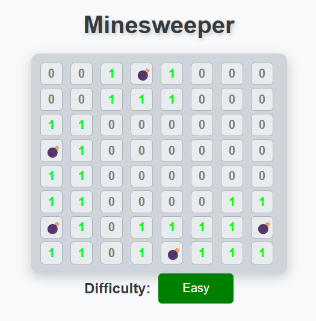
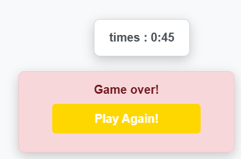

# Minesweeper

### A web for playing minesweeper
[WEB](https://blameazu.github.io/minesweeper/main.html)

# Functions

* Basic Minesweeper functions

* Difficulty selection system

# How it works?

* Using **html** to generate the construction of web

* Using **css** to make my web prettier!

* Using **javascript** to dispose the operations of user input

* Also add some algorithms to operate more efficiently and clearly

# Screenshot

